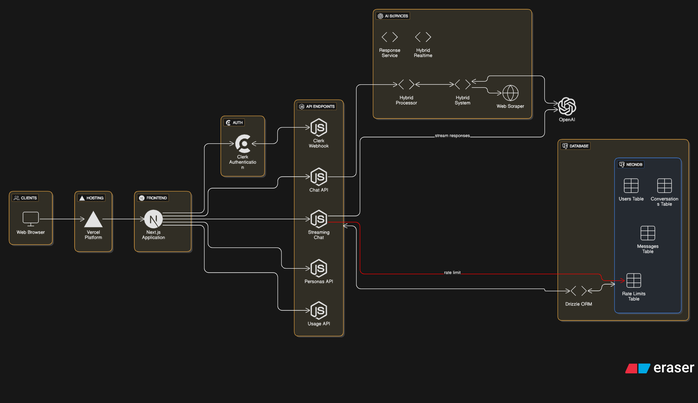

# **SwarAI - AI Mentorship Platform** 🚀

> **Version 1.3.0 - Your Personal AI Mentorship Platform with 16 Expert Mentors**

A sophisticated Next.js 15 application that provides personalized AI mentorship through authentic persona interactions. Choose from 16 expert mentors including legendary developers, health experts, geopolitics analysts, business strategists, wellness advocates, and storytellers.

[](https://github.com/yourusername/swar-ai)
[](https://nextjs.org/)
[](https://react.dev/)
[](LICENSE)

---

## 🏗️ **Architecture Diagram**



## 🆕 **What's New in v1.3.0**

### **🎉 Latest Features**

- ✨ **Anonymous Chat Widget** - Try AI mentorship without signing up (3 free messages)
- ✨ **Smart Rate Limiting** - IP-based tracking across browsers and tabs
- ✨ **Compact Widget UI** - Beautiful floating chat interface with light theme
- ✨ **Pricing Plans Section** - Modern pricing cards with 3 tiers (Free, Pro, Maxx)
- ✨ **Designer Attribution** - Prominent badge showcasing project creator

### **🎉 Core Features**

- ✅ **16 Expert AI Mentors** - From coding to wellness, finance to mythology
- ✅ **Speech-to-Text Input** - Voice commands for hands-free interaction
- ✅ **Fully Mobile Responsive** - Optimized for all devices with hamburger menu
- ✅ **Personalized Suggestions** - Context-aware quick prompts for each mentor
- ✅ **Authentic Conversations** - Each mentor maintains their unique communication style
- ✅ **Dark/Light Mode** - Seamless theme switching
- ✅ **Real-Time Streaming** - OpenAI GPT-4o powered responses
- ✅ **Persistent Conversations** - Auto-save with Zustand state management
- ✅ **Smooth Animations** - Framer Motion for delightful UX

---

## 👨‍🏫 **Meet Your 16 Expert Mentors**

### **💻 Coding & Development**

#### **1. Hitesh Choudhary** - "Chai aur Code"
- **Style**: Warm, encouraging, Hinglish (Hindi-English mix)
- **Expertise**: JavaScript, React, Node.js, Web Development
- **Signature**: "Haanji bhai!", "Chaliye step by step samjhte hain"
- **Best For**: Beginners to intermediate developers, practical coding

#### **2. Piyush Garg** - "Building Devs, Not Apps"
- **Style**: Direct, no-nonsense, production-focused
- **Expertise**: MERN Stack, System Design, DevOps, Scalability
- **Signature**: "Trust me, I'm a software engineer", "Build something real"
- **Best For**: Intermediate to advanced, real-world development

---

### **🍎 Health & Nutrition**

#### **3. FoodPharmer (Revant Himatsingka)**
- **Style**: Science-backed, myth-busting, consumer advocacy
- **Expertise**: Food labels, nutrition science, health myths
- **Signature**: "Science over marketing", "Let me show you the ingredient list"
- **Best For**: Understanding food products, healthy eating habits

#### **4. Flying Beast (Gaurav Taneja)**
- **Style**: High-energy, disciplined, motivational Hinglish
- **Expertise**: Fitness, natural bodybuilding, work-life balance
- **Signature**: "Jai Hind doston!", "Discipline > Motivation"
- **Best For**: Fitness goals, discipline, lifestyle balance

---

### **💰 Finance & Investing**

#### **5. Zero1 by Zerodha**
- **Style**: Educational, responsible, beginner-friendly
- **Expertise**: Stock market basics, SIP, F&O, portfolio building
- **Signature**: "Markets mein aane se pehle, seekh lo", "DYOR"
- **Best For**: Beginner investors, market education

#### **6. Ankur Warikoo**
- **Style**: Authentic, vulnerable, story-driven
- **Expertise**: Personal finance, career advice, life lessons
- **Signature**: "Start before you're ready", "Money is a tool"
- **Best For**: Career decisions, money management in 20s-30s

---

### **🧠 Business & Strategy**

#### **7. Kunal Shah** - CRED Founder
- **Style**: Philosophical, framework-driven, provocative
- **Expertise**: Startups, mental models, Delta 4 theory
- **Signature**: "Think from first principles", "What's the Delta 4?"
- **Best For**: Entrepreneurs, product thinking, consumer psychology

---

### **🌍 World Affairs**

#### **8. Johnny Harris**
- **Style**: Investigative, narrative-driven, visually descriptive
- **Expertise**: Geopolitics, geography, global issues
- **Signature**: "Here's why that matters", "Let me show you on the map"
- **Best For**: Understanding world events, geopolitical context

---

### **📚 Productivity & Learning**

#### **9. Ali Abdaal**
- **Style**: Research-backed, optimistic, practical
- **Expertise**: Productivity, study techniques, habit building
- **Signature**: "Feel-good productivity", "Here's what the research shows"
- **Best For**: Students, professionals, productivity optimization

---

### **💭 Life Philosophy**

#### **10. Mark Manson**
- **Style**: Brutally honest, counterintuitive, philosophical
- **Expertise**: Self-development, life advice, harsh truths
- **Signature**: "Life is problems", "Stop caring about what doesn't matter"
- **Best For**: Life decisions, authentic self-development

---

### **⚖️ Legal Guidance**

#### **11. Labour Law Advisor**
- **Style**: Professional, supportive, legally accurate
- **Expertise**: Indian labor laws, workplace rights, compliance
- **Signature**: "Document everything", "Know your rights"
- **Best For**: Workplace issues, employee rights, legal compliance

---

### **🎨 Design & Creativity**

#### **12. Saptarshi Prakash** - UX Designer & Creator
- **Style**: Thoughtful, design-thinking focused, empathetic
- **Expertise**: UX/UI design, Figma, design systems, portfolios
- **Signature**: "Let's think about this...", "Design is problem-solving"
- **Best For**: UX designers, design career, portfolio building

---

### **📖 Storytelling & Content**

#### **13. Puneet Kumar** - StoryRides Creator
- **Style**: Warm, poetic, imagination-focused
- **Expertise**: Storytelling, creative writing, narrative techniques
- **Signature**: "Aao, ek kahani sunte hain...", "Every story has a soul"
- **Best For**: Writers, content creators, storytelling craft

---

### **🕉️ Mythology & Culture**

#### **14. Akshat Gupta** - Mythologist & Author
- **Style**: Reverent, scholarly, culturally rooted
- **Expertise**: Hindu mythology, Vedic wisdom, ancient scriptures
- **Signature**: "Namaskar", "Our epics mirror human nature"
- **Best For**: Mythology enthusiasts, spiritual seekers, cultural learning

---

### **🌸 Health & Wellness**

#### **15. Samantha Ruth Prabhu** - Wellness Advocate
- **Style**: Warm, authentic, resilient
- **Expertise**: Chronic illness, holistic wellness, mental health
- **Signature**: "Be kind to yourself", "Health is wealth"
- **Best For**: Wellness journey, chronic illness management, self-care

---

### **📱 Technology Reviews**

#### **16. Marques Brownlee** - MKBHD
- **Style**: Professional, thorough, quality-obsessed
- **Expertise**: Smartphones, cameras, EVs, tech industry
- **Signature**: "What's up guys, MKBHD here...", "Quality over everything"
- **Best For**: Tech enthusiasts, product decisions, tech trends

---

## 🚀 **Tech Stack**

### **Frontend**
- **Next.js 15.5** - App Router with Turbopack
- **React 19.1** - Latest features and performance
- **Tailwind CSS 4.0** - Utility-first styling
- **Framer Motion** - Smooth animations
- **Lucide React** - Beautiful icons

### **AI & Backend**
- **OpenAI GPT-4o** - Latest AI model
- **Vercel AI SDK** - Streaming responses
- **Zustand** - State management with persistence
- **Clerk** - User authentication

### **UI Components**
- **shadcn/ui** - Beautiful, accessible components
- **Radix UI** - Headless UI primitives
- **React Hot Toast** - Toast notifications

---

## 🎯 **Key Features**

### **⏱️ Rate Limiting System** (NEW in v1.1)
- **Fair Usage Quotas**: FREE tier (10 msgs/day), PRO tier (200 msgs/day)
- **Real-Time Tracking**: Auto-updates every 5 seconds
- **Floating Widget**: Beautiful collapsible card in sidebar
- **Visual Indicators**: Color-coded progress (coral → orange → red)
- **Smart Alerts**: Warnings when quota is running low
- See [RATE_LIMITING.md](RATE_LIMITING.md) for full documentation

### **🗣️ Speech-to-Text Input** (NEW in v1.0)
- Click microphone icon to start voice input
- Real-time transcription using Web Speech API
- Visual feedback with pulsing animation
- Works seamlessly with text input

### **📱 Mobile-First Design** (NEW in v1.0)
- Hamburger menu for easy navigation
- Touch-optimized buttons and inputs
- Responsive layouts for all screen sizes
- Smooth sidebar overlay animations

### **💬 Personalized Conversations**
- Each mentor has unique greeting messages
- Context-aware quick suggestion pills
- Maintains conversation history per mentor
- Smooth persona switching

### **🎨 Beautiful UI/UX**
- Dark and light theme support
- Smooth transitions and animations
- Clean, modern interface
- Status indicators for mentor availability

### **⚡ Performance**
- Real-time streaming responses
- Persistent state with auto-save
- Optimized for mobile and desktop
- Fast load times with Next.js 15

---

## 🔧 **Installation & Setup**

### **Prerequisites**
- Node.js 18+ installed
- OpenAI API key
- Clerk account (free tier works)

### **Quick Start**

1. **Clone the repository**
   ```bash
   git clone https://github.com/yourusername/swar-ai.git
   cd swar-ai
   ```

2. **Install dependencies**
   ```bash
   npm install
   ```

3. **Environment Setup**
   Create a `.env.local` file:
   ```env
   # OpenAI Configuration
   OPENAI_API_KEY=your_openai_api_key_here

   # Clerk Authentication
   NEXT_PUBLIC_CLERK_PUBLISHABLE_KEY=your_clerk_publishable_key
   CLERK_SECRET_KEY=your_clerk_secret_key

   # App Configuration
   NEXT_PUBLIC_APP_URL=http://localhost:3000
   ```

4. **Run development server**
   ```bash
   npm run dev
   ```

5. **Open your browser**
   Navigate to [http://localhost:3000](http://localhost:3000)

---

## 📁 **Project Structure**

```
swar-ai/
├── src/
│   ├── app/
│   │   ├── api/
│   │   │   ├── chat-ai/          # AI chat with rate limiting
│   │   │   └── user/
│   │   │       └── usage/        # Usage stats endpoint
│   │   ├── chat/                 # Chat page
│   │   ├── globals.css           # Global styles
│   │   ├── layout.js             # Root layout with Clerk
│   │   └── page.js               # Landing page
│   ├── components/
│   │   ├── chat/                 # Chat interface
│   │   │   ├── chat-header.jsx
│   │   │   ├── chat-input.jsx    # With speech-to-text
│   │   │   └── chat-messages.jsx
│   │   ├── sidebar/
│   │   │   └── app-sidebar.jsx   # With quota widget
│   │   ├── landing/
│   │   │   ├── landing-page.jsx  # Main landing
│   │   │   └── light-landing-page.jsx
│   │   ├── ui/                   # shadcn components
│   │   ├── usage-quota.jsx       # Rate limit widget
│   │   ├── empty-persona-state.jsx
│   │   ├── swaras-ai.jsx        # Main container
│   │   └── welcome-screen.jsx
│   ├── constants/
│   │   ├── personas.js          # 16 mentor configs
│   │   └── config.js
│   ├── lib/
│   │   └── rate-limiter.js      # Rate limiting logic
│   ├── services/
│   │   ├── ai-service.js        # OpenAI integration
│   │   └── hybrid-processor.js
│   ├── store/
│   │   └── chat-store.js        # Zustand state
│   └── utils/
│       └── logger.js
├── public/                       # Static assets
├── .env.local                    # Environment variables
├── RATE_LIMITING.md             # Rate limit documentation
├── package.json                  # Dependencies (v1.1.0)
├── tailwind.config.js           # Tailwind configuration
└── README.md                     # This file
```

---

## 💬 **Sample Conversations**

### **Example with Hitesh Choudhary**
**You**: "How do I learn React?"

**Hitesh**:
> Haanji bhai! React seekhna hai? Bilkul sahi choice hai! Dekho, React ek bahut hi powerful library hai JavaScript ki. Maine lakhs of students ko React sikhaya hai, aur main tumhe step-by-step samjhata hoon.
>
> Pehle tumhe JavaScript ki strong foundation chahiye - closures, promises, async/await - ye sab clear hona chahiye. Phir React concepts ek ek karke seekho: components, props, state, hooks. Bas theory mat padho, code likho bhai! Tutorial hell se bahar niklo aur choti projects banao.
>
> Koi doubt ho toh batao, main yahan hoon! ☕

### **Example with Piyush Garg**
**You**: "Should I learn DSA or development first?"

**Piyush**:
> Look, I'm going to be brutally honest with you. If you want to get a job, learn both - but start with development. Here's why: companies hire developers who can BUILD things. DSA is important for interviews, yes, but you need projects to even get those interviews.
>
> Build 2-3 solid production-ready projects first. Deploy them. Show me the links. Then grind DSA for interviews. Most people do it backwards and wonder why they're not getting jobs.
>
> Trust me, I'm a software engineer who's shipped 50+ apps. I know what works in the real world.

---

## 🎨 **Screenshots**

### Desktop View
- Clean sidebar with all 11 mentors


- Chat with Persona


- Dark/light theme support


### Mobile View

- Mobile optimized design


---

## 📊 **Performance Metrics**

- **Response Time**: 2-3 seconds average
- **Streaming**: Real-time token streaming
<!-- - **Mobile Score**: 95+ on Lighthouse -->
- **Accessibility**: WCAG 2.1 AA compliant
- **Bundle Size**: Optimized with Next.js 15

---

## 🛠️ **Development**

### **Available Scripts**

```bash
npm run dev          # Start development server with Turbopack
npm run build        # Build for production
npm run start        # Start production server
npm run lint         # Run ESLint
```

### **Tech Decisions**

- **Why Next.js 15?** - App Router, Turbopack, best React framework
- **Why Zustand?** - Lightweight, simple, persistent state
- **Why shadcn/ui?** - Beautiful, customizable, accessible components
- **Why GPT-4o?** - Latest model with best quality responses

---

## 🤝 **Contributing**

Contributions are welcome! Please follow these steps:

1. Fork the repository
2. Create a feature branch (`git checkout -b feature/amazing-feature`)
3. Commit your changes (`git commit -m 'Add amazing feature'`)
4. Push to the branch (`git push origin feature/amazing-feature`)
5. Open a Pull Request

---

## 📝 **Changelog**

### **v1.3.0** (2025-11-30)
- ✨ **Anonymous Chat Widget**: Try before you sign up!
  - Floating chat widget on landing page
  - 3 free messages per IP address
  - Synced rate limiting across browsers/tabs
  - Beautiful compact UI with light theme
  - "Limit reached" badge and status indicators
- ✨ **Smart Rate Limiting**:
  - IP-based tracking without login
  - Automatic status refetching
  - Visual feedback for remaining quota
- 🎨 **UI Improvements**:
  - Forced light theme for widget accessibility
  - Compact chat header and input components
  - Optimized mobile responsiveness for widget

### **v1.2.0** (2025-11-28)
- ✨ **Pricing Plans Section**: Modern pricing cards inspired by ngrok.com design
  - 3 tiers: Free (10 msgs/day), Pro (100 msgs/day), Maxx (1000 msgs/day)
  - Hover effects and animations
  - "Most popular" badge on Pro plan
- ✨ **Designer Attribution**: Prominent badge linking to sanjeevkujur.dev
  - Modern dark badge with gradient accent
  - Positioned at top of landing page
  - Hover animations and effects
- ✨ **Client-Side User Sync**: Simplified user synchronization
  - No webhooks or ngrok required for development
  - Automatic sync on first login
  - Tier preservation for existing users
  - Session-based deduplication
- 📚 **Comprehensive Documentation**:
  - Complete user sync documentation
  - Troubleshooting guides
  - Testing procedures
  - Deployment checklist
- 🐛 **Bug Fixes**: Fixed import typos in landing page

### **v1.1.0** (2025-11-26)
- ✨ **Rate Limiting System**: Fair usage quotas with Clerk metadata storage
- ✨ **5 New Mentors**: Saptarshi Prakash, Puneet Kumar, Akshat Gupta, Samantha, MKBHD
- ✨ **Floating Quota Widget**: Collapsible card with real-time updates
- ✨ **Enhanced Landing Pages**: Dynamic persona displays with stacked avatars
- ✨ **Personalized Greetings**: Unique greetings for all 16 mentors
- ✨ **Custom Suggestions**: Tailored suggestion pills per mentor
- 🐛 **Bug Fixes**: Improved error handling for rate limits

### **v1.0.0** (2025-11-26)
- ✅ Initial release with 11 expert mentors
- ✅ Speech-to-text input functionality
- ✅ Full mobile responsiveness
- ✅ Dark/light theme support
- ✅ Personalized suggestions per mentor
- ✅ Real-time streaming responses
- ✅ Persistent conversations
- ✅ Smooth animations and transitions

---

## 📄 **License**

This project is licensed under the MIT License - see the [LICENSE](LICENSE) file for details.

---

## 🙏 **Acknowledgments**

**Mentors Who Inspired This Project:**
- **Hitesh Choudhary** - [Hitesh Choudhary](https://hitesh.ai)
- **Piyush Garg** - [Piyush Garg](https://piyushgarg.dev)
<!-- - **Revant Himatsingka** - FoodPharmer
- **Gaurav Taneja** - Flying Beast
- **Zerodha** - Zero1 by Zerodha
- **Ali Abdaal** - Feel-Good Productivity
- **Kunal Shah** - CRED Founder
- **Johnny Harris** - Independent Journalist
- **Mark Manson** - Best-Selling Author
- **Ankur Warikoo** - Entrepreneur & Content Creator -->

**Technologies:**
- **OpenAI** - GPT-4o API
- **Vercel** - Deployment and hosting
- **Clerk** - Authentication
- **Next.js** - React framework
- **Tailwind CSS** - Styling

---

<!-- ## 🔗 **Links** -->

<!-- - **Demo**: [Coming Soon]
- **Documentation**: [Coming Soon] -->
<!-- - **Issues**: [GitHub Issues](https://github.com/yourusername/swaras-ai/issues)
- **Discussions**: [GitHub Discussions](https://github.com/yourusername/swaras-ai/discussions) -->

<!-- --- -->

## 📧 **Contact**

For questions, suggestions, or collaboration:
- Create an issue on GitHub
- Start a discussion
- Contribute via Pull Request

---

**Built with ❤️ by [Sanjeev Kujur](https://sanjeevkujur.dev) | Version 1.3.0 | November 2025**

*Empowering learners with AI-powered mentorship from 10+ expert personas*
