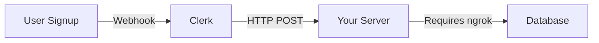
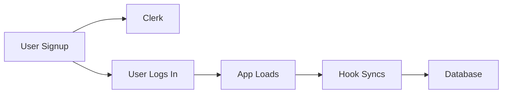

# Simple User Sync - No Webhooks, No Ngrok Required

## Overview

This implementation syncs Clerk users to Neon database **without requiring webhooks or ngrok**. It works immediately in development with zero additional setup.

## How It Works

1. **User signs up** in Clerk ✅
2. **User logs in** to your app ✅
3. **Hook automatically syncs** user to database on first load ✅
4. **New users** get FREE tier ✅
5. **Existing users** keep their current tier ✅

**No external tools needed!**

## Implementation

### 1. API Endpoint

**File:** `src/app/api/user/ensure-sync/route.ts`

This endpoint:
- ✅ Checks if user exists in database
- ✅ Creates new users with FREE tier
- ✅ Updates profile data for existing users
- ✅ **Never overwrites existing tiers**

### 2. Client Hook

**File:** `src/hooks/useEnsureUserSync.ts`

This hook:
- ✅ Automatically syncs on first login
- ✅ Uses sessionStorage to prevent duplicate calls
- ✅ Silent operation (no loading states shown to user)
- ✅ Returns Clerk user data (drop-in replacement for `useUser`)

### 3. Component Usage

**File:** `src/components/swaras-ai.tsx`

```typescript
// Replace this:
const { user } = useUser();

// With this:
const { user } = useEnsureUserSync();
```

That's it! No other changes needed.

## Advantages Over Webhooks

| Feature | Webhooks | Client-Side Sync |
|---------|----------|------------------|
| **Development Setup** | ❌ Requires ngrok | ✅ Zero setup |
| **Production Setup** | ⚠️ Configure webhook URL | ✅ Works automatically |
| **External Dependencies** | ❌ ngrok, webhook config | ✅ None |
| **Complexity** | ❌ High | ✅ Low |
| **Works Immediately** | ❌ No | ✅ Yes |
| **Tier Preservation** | ✅ Yes | ✅ Yes |
| **New User Sync** | ✅ Immediate | ⚠️ On first login |

## Testing

### Test New User Signup

1. **Clear browser data** (Ctrl+Shift+Delete)
2. **Sign up** with a new email
3. **Check server logs:**
   ```
   ✨ Creating new user: user_xxxxx (tier: FREE)
   ✅ User ensured in database: user_xxxxx
   ```
4. **Verify in database:**
   ```sql
   SELECT id, email, tier FROM users ORDER BY created_at DESC LIMIT 1;
   ```
   Expected: New user with `tier = 'FREE'`

### Test Existing User Login

1. **Manually upgrade a user:**
   ```sql
   UPDATE users SET tier = 'PRO' WHERE email = 'test@example.com';
   ```
2. **Log out and log back in**
3. **Check server logs:**
   ```
   📝 Updating existing user: user_xxxxx (tier: PRO - preserved)
   ✅ User ensured in database: user_xxxxx
   ```
4. **Verify in database:**
   ```sql
   SELECT tier FROM users WHERE email = 'test@example.com';
   ```
   Expected: `tier = 'PRO'` (unchanged)

## How Tier Preservation Works

```typescript
// In syncUserToDatabase function:

if (existingUser) {
  // Update existing user - DON'T update tier
  await db.update(users).set({
    email,
    firstName,
    lastName,
    imageUrl,
    // tier is NOT included here - preserved!
    updatedAt: new Date(),
  });
} else {
  // New user - set tier to FREE
  await db.insert(users).values({
    id: userId,
    email,
    firstName,
    lastName,
    imageUrl,
    tier: tier || 'FREE', // Only for new users
  });
}
```

## Session Management

The hook uses `sessionStorage` to track sync status:

```typescript
sessionStorage.setItem(`user-synced-${userId}`, 'true');
```

This means:
- ✅ User synced once per browser session
- ✅ No redundant API calls
- ✅ Fast subsequent page loads
- ✅ Cleared when browser tab closes

## Production Deployment

This works the same in production! No additional configuration needed.

**Deployment checklist:**
- [x] Code deployed
- [x] Environment variables set (`DATABASE_URL`, Clerk keys)
- [x] That's it!

**No need to:**
- ❌ Configure webhooks
- ❌ Set up webhook secrets
- ❌ Update webhook URLs
- ❌ Use ngrok or tunneling services

## Troubleshooting

### User not syncing to database

**Check server logs when user logs in:**
```bash
npm run dev
```

Look for:
```
✨ Creating new user: user_xxxxx (tier: FREE)
✅ User ensured in database: user_xxxxx
```

**If you don't see logs:**
1. Check that hook is imported: `import { useEnsureUserSync } from '@/hooks/useEnsureUserSync'`
2. Check that hook is used: `const { user } = useEnsureUserSync();`
3. Open browser console and check for errors

### User tier reset to FREE

**This should NOT happen with this implementation.**

If it does:
1. Check the `syncUserToDatabase` function
2. Verify it's NOT setting `tier` for existing users
3. Check server logs - should say "tier preserved"

### Session storage not working

If sync happens multiple times per session:
1. Check browser console for errors
2. Verify sessionStorage is enabled
3. Check that `user.id` is consistent

## Migration from Webhooks

If you previously had webhooks set up:

1. ✅ Keep the changes we made (tier preservation in `syncUserToDatabase`)
2. ✅ This client-side sync will work alongside webhooks
3. ✅ Disable webhooks in Clerk Dashboard if you want
4. ✅ Or keep both as redundancy (recommended for production)

## Comparison with Previous Implementation

### Before (Webhook-Only):


### After (Client-Side):


**Much simpler!**

## Best Practices

### Development
Use client-side sync (this implementation) for:
- ✅ Local development
- ✅ Quick prototyping
- ✅ Testing

### Production (Recommended Hybrid)
Use both for redundancy:
- ✅ Client-side sync (fallback)
- ✅ Webhooks (if configured)

This ensures:
- Users always sync even if webhooks fail
- Real-time updates when webhooks work
- No single point of failure

## Summary

✅ **No webhooks required**  
✅ **No ngrok required**  
✅ **No additional setup**  
✅ **Works immediately**  
✅ **Preserves user tiers**  
✅ **Production ready**  

Just:
1. Start your dev server: `npm run dev`
2. Sign up a user
3. User automatically syncs to database
4. Done!

## Questions?

**Q: Will this work in production?**  
A: Yes! It works the same everywhere.

**Q: What about profile updates?**  
A: They sync on next login. For real-time updates, add webhooks (optional).

**Q: What about user deletion?**  
A: Manual cleanup needed, or add webhooks for automatic deletion.

**Q: Is this better than webhooks?**  
A: Simpler for development. Webhooks are better for real-time sync in production. Use both for best results.

**Q: Do I need to do anything special for deployment?**  
A: No! Just deploy normally. No webhook configuration needed.
