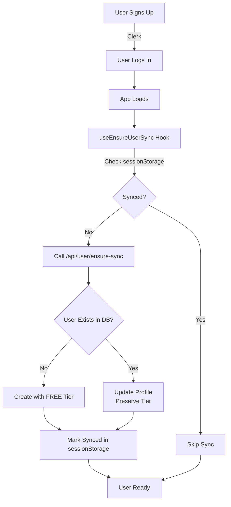

# SwarAI Documentation Index

Welcome to the SwarAI documentation! This index helps you find the right documentation for your needs.

## 🚀 Quick Start

**First time here?** Start with these:

1. **[READY_TO_USE.md](./READY_TO_USE.md)** - Get started immediately
2. **[USER_SYNC_DOCUMENTATION.md](./USER_SYNC_DOCUMENTATION.md)** - Complete user sync guide
3. **[CLERK_SETUP.md](./CLERK_SETUP.md)** - Clerk authentication setup

## 📚 Documentation Structure

### Core System Documentation

#### User Synchronization (Current System)

| Document | Purpose | Audience |
|----------|---------|----------|
| **[USER_SYNC_DOCUMENTATION.md](./USER_SYNC_DOCUMENTATION.md)** | 📖 **Master documentation** - Complete guide | Everyone |
| **[READY_TO_USE.md](./READY_TO_USE.md)** | ⚡ Quick start with testing | Developers |
| **[CLIENT_SIDE_SYNC.md](./CLIENT_SIDE_SYNC.md)** | 🔧 Client-side implementation details | Developers |
| **[USER_SYNC_VERIFICATION.md](./USER_SYNC_VERIFICATION.md)** | ✅ Testing procedures | QA/Developers |

#### Alternative/Legacy Approaches

| Document | Purpose | When to Use |
|----------|---------|-------------|
| **[WEBHOOK_TROUBLESHOOTING.md](./WEBHOOK_TROUBLESHOOTING.md)** | 🔌 Webhook setup guide | Optional real-time sync |
| **[AUTO_USER_SYNC_GUIDE.md](./AUTO_USER_SYNC_GUIDE.md)** | 📚 Previous auto-sync implementation | Reference only |
| **[USER_SYNC_ARCHITECTURE.md](./USER_SYNC_ARCHITECTURE.md)** | 🏗️ Architecture overview | System design |

---

### Authentication & Database

| Document | Purpose |
|----------|---------|
| **[CLERK_SETUP.md](./CLERK_SETUP.md)** | Clerk authentication configuration |
| **[CLERK_SETUP_CHECKLIST.md](./CLERK_SETUP_CHECKLIST.md)** | Clerk setup checklist |
| **[CLERK_USER_SYNC.md](./CLERK_USER_SYNC.md)** | Legacy Clerk sync documentation |
| **[NEON_DB_SETUP.md](./NEON_DB_SETUP.md)** | Neon database setup |
| **[DRIZZLE_SETUP.md](./DRIZZLE_SETUP.md)** | Drizzle ORM configuration |

---

### Features & Functionality

| Document | Purpose |
|----------|---------|
| **[MESSAGE_PERSISTENCE.md](./MESSAGE_PERSISTENCE.md)** | Message storage and retrieval |
| **[ADDING_NEW_PERSONAS.md](./ADDING_NEW_PERSONAS.md)** | Adding AI mentor personas |
| **[GENERIC_PERSONA_SYSTEM.md](./GENERIC_PERSONA_SYSTEM.md)** | Persona system architecture |

---

### UI/UX Documentation

| Document | Purpose |
|----------|---------|
| **[ENHANCED_UI_SUMMARY.md](./ENHANCED_UI_SUMMARY.md)** | UI enhancement summary |
| **[MODERN_UI_UPDATE_SUMMARY.md](./MODERN_UI_UPDATE_SUMMARY.md)** | Modern UI updates |
| **[REFINED_UI_REDESIGN.md](./REFINED_UI_REDESIGN.md)** | UI redesign documentation |
| **[UI_REDESIGN_GUIDE.md](./UI_REDESIGN_GUIDE.md)** | UI redesign guidelines |

---

### Development Guides

| Document | Purpose |
|----------|---------|
| **[CONTRIBUTING.md](./CONTRIBUTING.md)** | Contributing guidelines |
| **[IMPLEMENTATION_SUMMARY.md](./IMPLEMENTATION_SUMMARY.md)** | Implementation overview |
| **[REFACTORING_SUMMARY.md](./REFACTORING_SUMMARY.md)** | Code refactoring summary |
| **[TYPESCRIPT_ERRORS_FIX_GUIDE.md](./TYPESCRIPT_ERRORS_FIX_GUIDE.md)** | TypeScript troubleshooting |

---

## 🎯 Use Case Guide

### "I want to..."

#### Get Started
→ **[READY_TO_USE.md](./READY_TO_USE.md)**  
→ **[USER_SYNC_DOCUMENTATION.md](./USER_SYNC_DOCUMENTATION.md)**

#### Set Up Authentication
→ **[CLERK_SETUP.md](./CLERK_SETUP.md)**  
→ **[CLERK_SETUP_CHECKLIST.md](./CLERK_SETUP_CHECKLIST.md)**

#### Understand User Sync
→ **[USER_SYNC_DOCUMENTATION.md](./USER_SYNC_DOCUMENTATION.md)** (Start here)  
→ **[CLIENT_SIDE_SYNC.md](./CLIENT_SIDE_SYNC.md)** (Implementation details)  
→ **[USER_SYNC_VERIFICATION.md](./USER_SYNC_VERIFICATION.md)** (Testing)

#### Set Up Webhooks (Optional)
→ **[WEBHOOK_TROUBLESHOOTING.md](./WEBHOOK_TROUBLESHOOTING.md)**  
→ **[CLERK_SETUP.md](./CLERK_SETUP.md)** (Section 8)

#### Configure Database
→ **[NEON_DB_SETUP.md](./NEON_DB_SETUP.md)**  
→ **[DRIZZLE_SETUP.md](./DRIZZLE_SETUP.md)**

#### Add New Features
→ **[ADDING_NEW_PERSONAS.md](./ADDING_NEW_PERSONAS.md)** (Add personas)  
→ **[MESSAGE_PERSISTENCE.md](./MESSAGE_PERSISTENCE.md)** (Message system)  
→ **[CONTRIBUTING.md](./CONTRIBUTING.md)** (Development guide)

#### Troubleshoot Issues
→ **[USER_SYNC_DOCUMENTATION.md](./USER_SYNC_DOCUMENTATION.md)** (Troubleshooting section)  
→ **[WEBHOOK_TROUBLESHOOTING.md](./WEBHOOK_TROUBLESHOOTING.md)** (Webhook issues)  
→ **[TYPESCRIPT_ERRORS_FIX_GUIDE.md](./TYPESCRIPT_ERRORS_FIX_GUIDE.md)** (TypeScript errors)

---

## 📊 Documentation Status

### Current & Recommended

✅ **USER_SYNC_DOCUMENTATION.md** - Complete, up-to-date  
✅ **READY_TO_USE.md** - Current implementation  
✅ **CLIENT_SIDE_SYNC.md** - Current approach  
✅ **USER_SYNC_VERIFICATION.md** - Current testing guide  
✅ **CLERK_SETUP.md** - Updated with webhook info  

### Optional/Advanced

⚠️ **WEBHOOK_TROUBLESHOOTING.md** - Optional for real-time sync  
⚠️ **USER_SYNC_ARCHITECTURE.md** - Reference for system design  

### Legacy/Reference Only

📚 **AUTO_USER_SYNC_GUIDE.md** - Previous implementation  
📚 **AUTO_USER_SYNC_IMPLEMENTATION.md** - Old approach  
📚 **AUTO_USER_SYNC_WALKTHROUGH.md** - Old walkthrough  
📚 **CLERK_USER_SYNC.md** - Legacy documentation  

---

## 🏗️ System Architecture Overview



---

## 🔑 Key Concepts

### User Sync System

**Current Implementation:** Client-Side Sync
- ✅ No webhooks required
- ✅ No ngrok needed
- ✅ Works immediately
- ✅ Tier preservation built-in

**How it works:**
1. User logs in
2. Hook automatically syncs to database
3. New users get FREE tier
4. Existing users keep their tier

### Tier Management

| Tier | Limit | Assignment |
|------|-------|------------|
| FREE | 10/day | Auto (new users) |
| PRO | 100/day | Manual upgrade |
| MAXX | 1000/day | Manual upgrade |

**Important:** Tiers are NEVER overwritten by sync system after initial assignment.

---

## 📞 Support

### Common Questions

**Q: Do I need webhooks?**  
A: No! Client-side sync works perfectly without them.

**Q: How do I upgrade users?**  
A: Manually in database or via admin panel (coming soon).

**Q: Will this work in production?**  
A: Yes! Deploy to Vercel with zero additional configuration.

**Q: What about real-time profile updates?**  
A: Add webhooks (optional) or updates sync on next login.

### Getting Help

1. Check **[USER_SYNC_DOCUMENTATION.md](./USER_SYNC_DOCUMENTATION.md)** troubleshooting section
2. Review **[READY_TO_USE.md](./READY_TO_USE.md)** for common issues
3. Check **[WEBHOOK_TROUBLESHOOTING.md](./WEBHOOK_TROUBLESHOOTING.md)** if using webhooks
4. Create an issue on GitHub

---

## 🎓 Learning Path

### For New Developers

1. Read **[READY_TO_USE.md](./READY_TO_USE.md)** (5 min)
2. Skim **[USER_SYNC_DOCUMENTATION.md](./USER_SYNC_DOCUMENTATION.md)** (15 min)
3. Follow **[CLERK_SETUP.md](./CLERK_SETUP.md)** (10 min)
4. Test with **[USER_SYNC_VERIFICATION.md](./USER_SYNC_VERIFICATION.md)** (15 min)
5. Start coding! 🚀

### For System Architects

1. Read **[USER_SYNC_ARCHITECTURE.md](./USER_SYNC_ARCHITECTURE.md)**
2. Review **[CLIENT_SIDE_SYNC.md](./CLIENT_SIDE_SYNC.md)**
3. Compare **[WEBHOOK_TROUBLESHOOTING.md](./WEBHOOK_TROUBLESHOOTING.md)** approach
4. Review database setup: **[NEON_DB_SETUP.md](./NEON_DB_SETUP.md)** + **[DRIZZLE_SETUP.md](./DRIZZLE_SETUP.md)**

### For QA/Testing

1. **[USER_SYNC_VERIFICATION.md](./USER_SYNC_VERIFICATION.md)** - Complete test suite
2. **[READY_TO_USE.md](./READY_TO_USE.md)** - Quick testing guide
3. **[USER_SYNC_DOCUMENTATION.md](./USER_SYNC_DOCUMENTATION.md)** - Edge cases

---

## 📝 Recent Updates

**2025-11-30:**
- ✅ Added **Anonymous Chat Widget** functionality
- ✅ Implemented IP-based rate limiting
- ✅ Updated documentation for v1.3.0

**2024-11-28:**
- ✅ Created comprehensive **USER_SYNC_DOCUMENTATION.md**
- ✅ Updated **READY_TO_USE.md** with current implementation
- ✅ Added **CLIENT_SIDE_SYNC.md** for developers
- ✅ Enhanced **CLERK_SETUP.md** with webhook guidance
- ✅ Added this **README.md** index

**Previous:**
- Webhook-based sync documented
- Auto-sync implementations
- UI/UX documentation

---

## 🚦 Quick Health Check

**Is your setup working?**

```bash
# 1. Check environment variables
cat .env.local | grep -E "(CLERK|DATABASE)"

# 2. Start dev server
npm run dev

# 3. Open browser
# http://localhost:3001

# 4. Sign up a new user

# 5. Check terminal for:
# ✨ Creating new user: user_xxx (tier: FREE)
# ✅ User ensured in database: user_xxx
```

If you see those logs → ✅ **Everything is working!**

---

## 📂 Directory Structure

```
docs/
├── README.md                           ← You are here 
├── USER_SYNC_DOCUMENTATION.md          ← Master Guide ⭐
├── READY_TO_USE.md                     ← Quick Start ⚡
├── CLIENT_SIDE_SYNC.md                 ← Implementation
├── USER_SYNC_VERIFICATION.md           ← Testing
├── WEBHOOK_TROUBLESHOOTING.md          ← Optional Webhooks
├── CLERK_SETUP.md                      ← Auth Setup
├── NEON_DB_SETUP.md                    ← Database Setup
└── ... (other documentation)
```

---

**Last Updated:** 2024-11-28  
**Maintained by:** SwarAI Development Team  
**Status:** Current & Active ✅

**Need help?** Start with **[USER_SYNC_DOCUMENTATION.md](./USER_SYNC_DOCUMENTATION.md)**!
