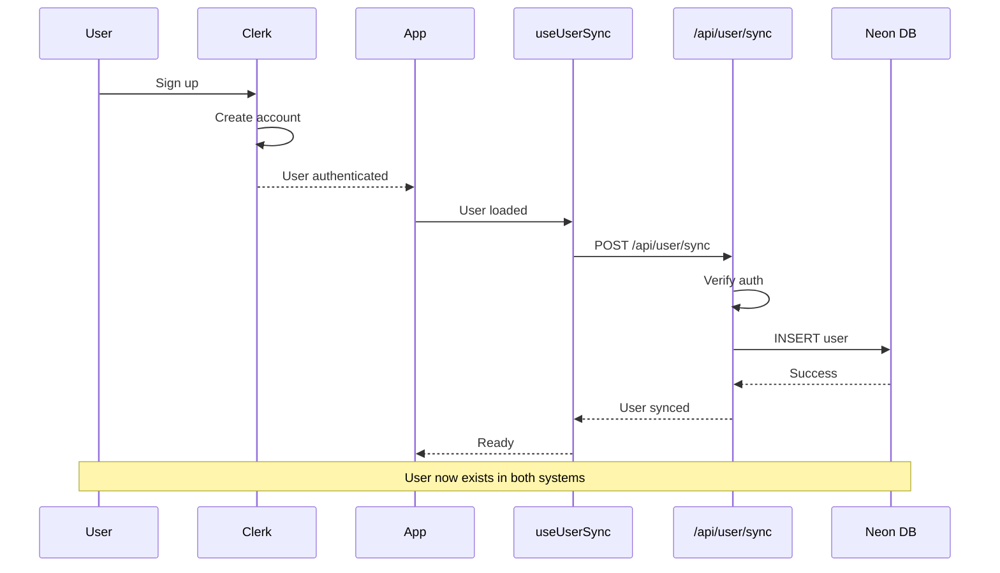
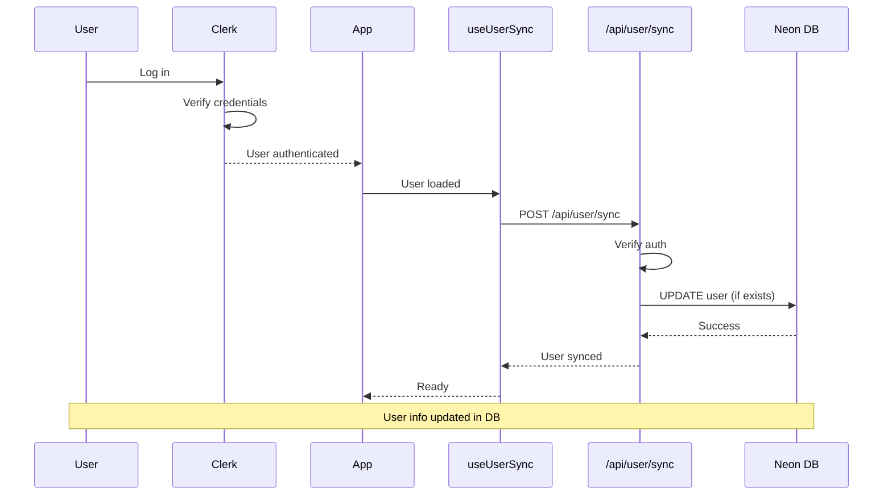

# User Synchronization Architecture

## Overview

SwarAI uses a dual-database architecture where **Clerk** handles authentication and **Neon DB** stores application data. User information is automatically synchronized between both systems to ensure consistency.

---

## Architecture Diagram

```mermaid
graph TB
    User[User Signs Up/Logs In]
    Clerk[Clerk Authentication]
    App[SwarAI Application]
    Hook[useUserSync Hook]
    API[/api/user/sync]
    NeonDB[(Neon Database)]
    
    User -->|Authenticate| Clerk
    Clerk -->|User Session| App
    App -->|Auto-trigger| Hook
    Hook -->|POST request| API
    API -->|Sync data| NeonDB
    
    style Clerk fill:#6366f1
    style NeonDB fill:#10b981
    style Hook fill:#f59e0b
```

---

## Data Storage Comparison

### Clerk (Authentication Provider)

**Purpose:** Handle user authentication and sessions

**Stores:**
- User ID (e.g., `user_2abc123xyz`)
- Email address
- First name
- Last name
- Profile image URL
- OAuth provider info
- Session tokens
- Authentication state

**Responsibilities:**
- ✅ User signup/login
- ✅ Password management
- ✅ OAuth integration (Google, GitHub)
- ✅ Session management
- ✅ Security & compliance

### Neon DB (Application Database)

**Purpose:** Store application-specific data

**Stores:**
- User ID (matches Clerk)
- Email (synced from Clerk)
- First name (synced from Clerk)
- Last name (synced from Clerk)
- Profile image URL (synced from Clerk)
- **Tier** (FREE, PRO, MAXX)
- **Rate limits** (message count, reset time)
- **Conversations** (chat history)
- **Messages** (user & AI messages)
- **Timestamps** (created, updated)

**Responsibilities:**
- ✅ Rate limiting
- ✅ Message persistence
- ✅ Conversation history
- ✅ User tier management
- ✅ Analytics & usage tracking

---

## Synchronization Flow

### 1. User Signs Up



### 2. User Logs In



---

## Implementation Details

### useUserSync Hook

**Location:** `src/hooks/useUserSync.ts`

**Purpose:** Automatically sync Clerk users to Neon DB on authentication

**Features:**
- Detects when user authenticates
- Calls sync API endpoint
- Prevents duplicate syncs using ref
- Provides same interface as `useUser()`

**Code:**
```typescript
export function useUserSync() {
  const { user, isLoaded } = useUser();
  const syncedRef = useRef(false);

  useEffect(() => {
    if (!isLoaded || !user || syncedRef.current) return;

    const syncUser = async () => {
      const response = await fetch('/api/user/sync', {
        method: 'POST',
        body: JSON.stringify({
          userId: user.id,
          email: user.primaryEmailAddress?.emailAddress,
          firstName: user.firstName,
          lastName: user.lastName,
          imageUrl: user.imageUrl,
        }),
      });
      
      if (response.ok) {
        syncedRef.current = true;
      }
    };

    syncUser();
  }, [user, isLoaded]);

  return { user, isLoaded };
}
```

### Sync API Endpoint

**Location:** `src/app/api/user/sync/route.ts`

**Purpose:** Securely sync user data to Neon DB

**Security:**
- ✅ Requires authentication
- ✅ Validates user ID matches authenticated user
- ✅ Validates required fields

**Process:**
1. Verify user is authenticated
2. Validate request data
3. Call `syncUserToDatabase()` function
4. Return success/error response

### Database Sync Function

**Location:** `src/lib/rate-limiter-db.ts`

**Function:** `syncUserToDatabase()`

**Process:**
1. Check if user exists in DB
2. If exists: UPDATE user data
3. If not exists: INSERT new user
4. Set default tier to FREE

---

## Data Consistency

### Primary Key

Both systems use the **same user ID** generated by Clerk:
- Clerk: `user_2abc123xyz`
- Neon DB: `user_2abc123xyz` (primary key)

### Sync Timing

| Event | Clerk | Neon DB | Sync Method |
|-------|-------|---------|-------------|
| User signs up | Immediate | On first login | useUserSync hook |
| User logs in | Immediate | Every login | useUserSync hook |
| User updates profile | Immediate | Next login | useUserSync hook |
| User deletes account | Immediate | Via webhook* | Webhook (optional) |

*Webhook for user deletion is already implemented but requires configuration

### Data Flow

```
Clerk (Source of Truth)  →  Neon DB (Synced Copy + App Data)
         ↓
    User ID ────────────────────→ User ID (Primary Key)
    Email ──────────────────────→ Email
    First Name ─────────────────→ First Name
    Last Name ──────────────────→ Last Name
    Image URL ──────────────────→ Image URL
                                   + Tier (FREE/PRO/MAXX)
                                   + Message Count
                                   + Conversations
                                   + Messages
```

---

## Advantages of This Approach

### ✅ No Webhook Configuration Required

- Works immediately in development
- No ngrok or tunnel needed
- No Clerk Dashboard configuration
- Deploy anywhere without setup

### ✅ Guaranteed Sync

- Syncs on every login
- Catches any missed users
- Self-healing (updates on login)
- No dependency on webhook delivery

### ✅ Simple & Reliable

- Minimal code changes
- Uses existing sync function
- Easy to understand
- Easy to debug

### ✅ Production Ready

- Works in any environment
- No external dependencies
- Secure authentication
- Scalable

---

## Optional: Webhook Enhancement

You can **optionally** add webhooks for instant sync:

### Webhook Benefits
- Instant sync on signup (no login required)
- Sync profile updates immediately
- Handle user deletions

### Webhook + Fallback = Best of Both Worlds
- Webhook syncs users instantly
- Fallback catches any missed users
- Maximum reliability

**Webhook Setup Guide:** See `docs/CLERK_SETUP.md`

---

## Database Schema

### Users Table

```sql
CREATE TABLE users (
  id TEXT PRIMARY KEY,           -- Clerk user ID
  email TEXT NOT NULL UNIQUE,
  first_name TEXT,
  last_name TEXT,
  image_url TEXT,
  tier TEXT DEFAULT 'FREE',      -- FREE, PRO, MAXX
  created_at TIMESTAMP DEFAULT NOW(),
  updated_at TIMESTAMP DEFAULT NOW()
);
```

### Rate Limits Table

```sql
CREATE TABLE rate_limits (
  id SERIAL PRIMARY KEY,
  user_id TEXT REFERENCES users(id) ON DELETE CASCADE,
  message_count INTEGER DEFAULT 0,
  last_reset_at TIMESTAMP DEFAULT NOW(),
  created_at TIMESTAMP DEFAULT NOW(),
  updated_at TIMESTAMP DEFAULT NOW()
);
```

---

## Troubleshooting

### User Not Syncing

**Check:**
1. User is authenticated in Clerk
2. Console logs show sync attempt
3. `/api/user/sync` returns 200
4. Database connection is working

**Debug:**
```bash
# Check database
npm run db:studio

# Check logs in browser console
# Look for: "🔄 Syncing user to database"
# Look for: "✅ User synced to database"
```

### Duplicate Sync Attempts

**Cause:** Hook running multiple times

**Solution:** Already handled by `syncedRef` in hook

### User Data Out of Sync

**Cause:** User updated profile in Clerk

**Solution:** User data updates on next login automatically

---

## Summary

| Aspect | Details |
|--------|---------|
| **Authentication** | Clerk (source of truth) |
| **App Data** | Neon DB (source of truth) |
| **User ID** | Same in both systems |
| **Sync Method** | Automatic on login |
| **Sync Trigger** | `useUserSync` hook |
| **Fallback** | Always syncs on login |
| **Webhooks** | Optional enhancement |
| **Setup Required** | None (works out of box) |

**Result:** Seamless user synchronization with zero configuration! 🎉
